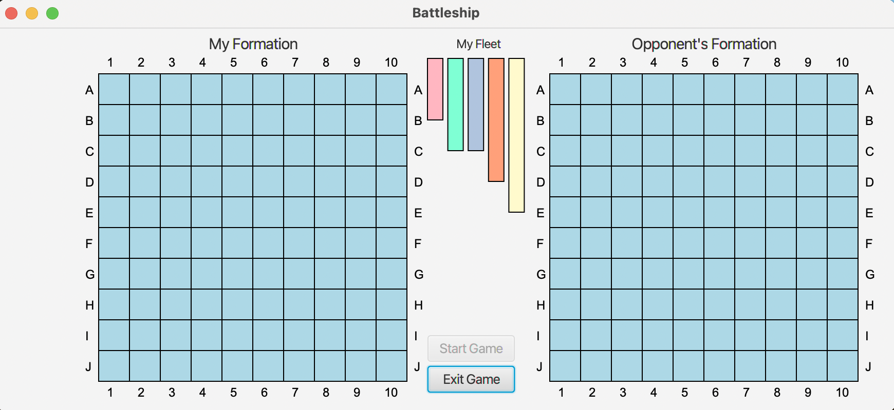

## Battleship Game
Welcome to the exciting world of Battleship, the classic board game of strategic naval warfare!

## Introduction
Battleship is a competitive turn-based game played between a human player and an AI opponent. The objective is to strategically sink the opponent's fleet of ships before your own ships are destroyed. With careful planning and tactical decision-making, you'll engage in an intense battle to outmaneuver your opponent.

## Stages of the Game
Battleship consists of several stages that add depth and excitement to the gameplay:

**Setup Phase:** In this stage, players position their ships on their respective boards. As the human player, you'll have the first opportunity to strategically place your ships, followed by the AI opponent.

**Game Loop:** Once the setup is complete, the game enters the loop where the action unfolds. The game loop includes the following steps:

- **Human Player's Turn:** You'll select a coordinate to attack the AI's board, aiming to hit their ships.

- **Win Condition Check:** After each attack, the game checks if either player has sunk all of their opponent's ships. If so, the game proceeds to the resolution phase.

- **AI Opponent's Turn:** The AI opponent selects a coordinate to attack your board, strategically trying to sink your ships.

- **Win Condition Check:** The game checks again if either player has achieved victory by sinking all of their opponent's ships.

**Resolution Phase:** Once the win condition is met, the game enters the resolution phase, signaling the end of the game. The winning player is determined based on who successfully sank all of the opponent's ships.

## Setup
To set up the Mark Management Application, follow these steps:

Install macOS 12.6 or a compatible operating system.

Install IntelliJ IDEA 2022.3.1 (Ultimate Edition) as your preferred Integrated Development Environment (IDE).

Ensure that you have kotlin.jvm 1.6.21 and Java SDK 17.0.5 (temurin) installed on your system.
